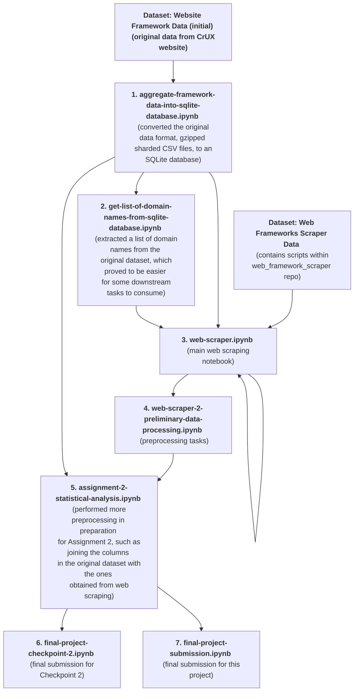

# Conversion and Analysis Pipeline for Project WebCensus

This repository contains all Jupyter notebooks used in the analysis and reporting for Project WebCensus. We used Kaggle's pipeline feature to connect multiple notebooks together by selecting a "previous" notebook's output data as a "current" notebook's input data.

Note that the datasets are not included in this GitHub repository due to size limitations; only the notebooks.

Here's a graph showing how the Kaggle notebooks and datasets used for this project are linked to one another:

